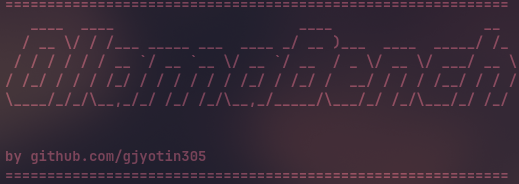

# Ollama Benchmarking



## Setup

First, create a virtual environment and activate it:

```bash
python -m venv bench
source ./bench/bin/activate
```

## Dependencies

Install required dependencies:

```bash
pip install -r requirements.txt
```

## How to Run

### Single Query Execution

Run a single query using the following command:

```bash
python main.py --model_name <model_name> --base_url <url> --test_query <test_query>
```

### Multiple Queries Execution

To run multiple queries from a file:

```bash
python main.py --model_name <model_name> --base_url <url> --test_file <file_path_txt>
```

#### Example

```bash
python main.py --model_name phi3:14b --base_url http://localhost:11434 --test_file ./samples/sample.txt
```

## Important Notes

- Ensure you have pulled the model you want to use before running the tests.
- A sample format for `test_file` is provided in `sample.txt` within the repository.
